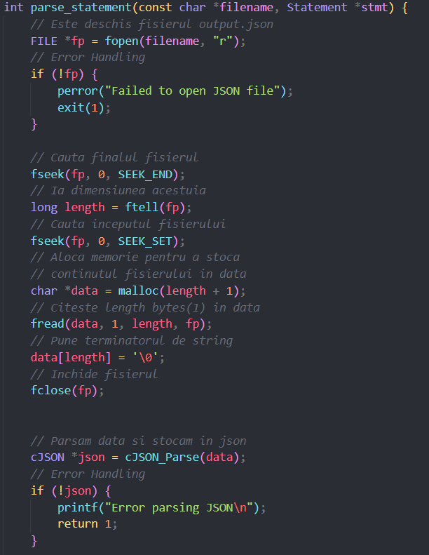

# Comentarii în Code Standards

Această secțiune documentează stilul de scriere a codului sursă în proiectul IndoDB, evidențiind importanța comentariilor clare și a respectării standardelor de codare.

---

## Comentarii în Cod

Pentru claritate și mentenanță ușoară, codul conține **comentarii explicative** în zonele esențiale:

- Descrierea scopului funcțiilor
- Explicații pentru secțiuni complexe de logică
- Menționarea limitărilor sau TODO-urilor

### Exemple de bune practici:

**Screenshot**: comentarii explicative în cod

---

## Respectarea standardelor de codare

Pentru a menține un stil coerent și profesional, am aplicat următoarele convenții de codare:

### snake_case pentru identificatori

Numele funcțiilor, variabilelor și fișierelor urmează convenția `snake_case` pentru lizibilitate:

---

### Modularizare prin Headere

Codul a fost împărțit în **fișiere .h și .c** pentru a separa declarațiile de implementări.

---

### Comunicare între componente prin Pipes

Am folosit **pipes interne** pentru a permite diferitelor componente să comunice într-un mod asincron și eficient (ex: între interpretul SQL și engine-ul de execuție).

---

### Error Handling

- Toate funcțiile critice returnează coduri de eroare sau NULL
- Erorile sunt gestionate centralizat, iar mesajele sunt transmise către utilizator

---
