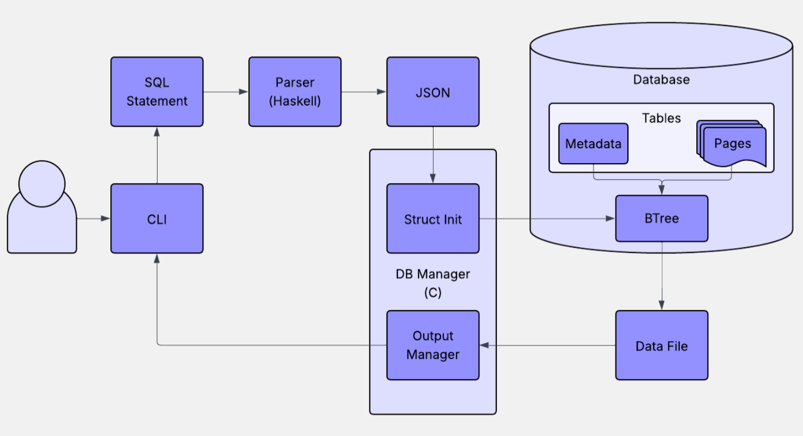

# Diagrame UML și Workflow

Această secțiune documentează **arhitectura aplicației** și **procesul de lucru în echipă**, folosind diagrame UML și un sistem de workflow vizual pentru organizarea sarcinilor.

---

## Diagrama arhitecturii aplicației (UML)

Diagrama de mai jos ilustrează componentele principale ale aplicației IndoDB, relațiile dintre acestea și interacțiunea cu utilizatorul prin comenzi SQL.

---

## Workflow – Organizarea procesului de lucru

Pentru organizarea eficientă a taskurilor, am utilizat **Jira** ca sistem de management al proiectului, configurat cu un workflow format din **5 coloane**:

- **TO DO** – pentru taskuri planificate dar încă neîncepute.
- **BUGS** – pentru raportarea și urmărirea erorilor apărute.
- **IN PROGRESS** – pentru taskurile la care se lucrează activ.
- **TEST** – pentru sarcinile care trebuie validate prin testare.
- **DONE** – pentru taskurile finalizate și verificate.

### Modul de lucru colaborativ:

- Fiecare membru al echipei își adăuga singur taskurile pe care urma să le realizeze.
- Descrierile taskurilor erau detaliate pentru a permite atribuirea către alți colegi atunci când era necesar.
- Am folosit **comentariile** în Jira pentru a documenta progresul, obstacolele întâmpinate și soluțiile implementate.

- **Imagine workflow general:**

- **Exemplu task detaliat cu comentarii și descriere:**

---
