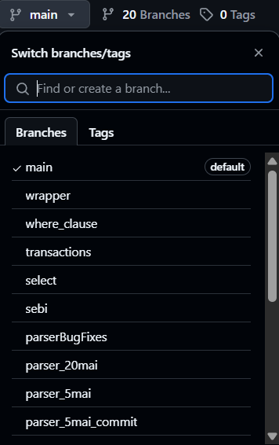
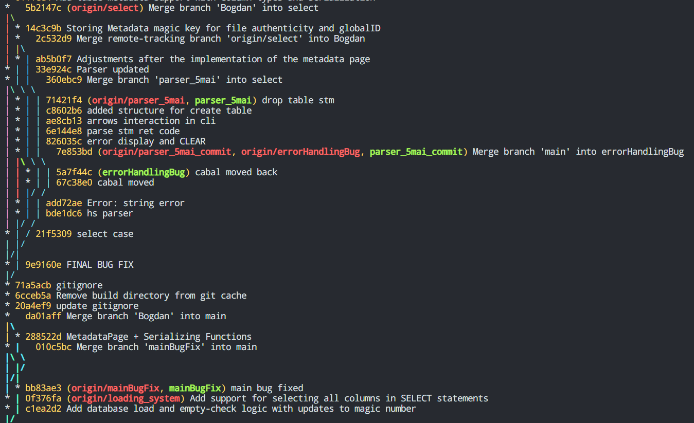
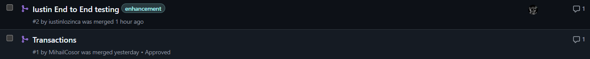
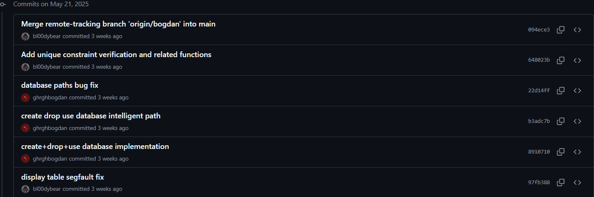

# Source Control cu Git

Această secțiune documentează modul în care a fost utilizat sistemul de control al versiunilor **Git** în cadrul proiectului IndoDB, punând accent pe bune practici și colaborare eficientă în echipă.

---

## Crearea Branch-urilor

Pentru a menține codul organizat și a evita conflictele, fiecare funcționalitate sau bug fix a fost dezvoltat pe un **branch separat**.

**Screenshot**: Branch-urile proiectului

---

## Merge

Am utilizat `merge` pentru a păstra istoricul dezvoltării pe branchuri lungi.

**Screenshot**: Arborele branchurilor

---

## Pull Requests (PR)

Pentru fiecare coechipier care trebuia sa dea push in `main` prin **Pull Requests**, fiecare fiind:

- Revizuit de cel puțin un coleg.
- Însoțit de o descriere clară a modificărilor.

**Screenshot**: Pull Requests

---

## Commit-uri semnificative

Toate commit-urile au fost:

- Descriptive (ex: `Implement INSERT command`, `Fix table deletion bug`)
- Frecvente, reflectând progresul real
- Grupate logic (un commit/funcționalitate)

**Screenshot**: Log cu commit-uri

---
