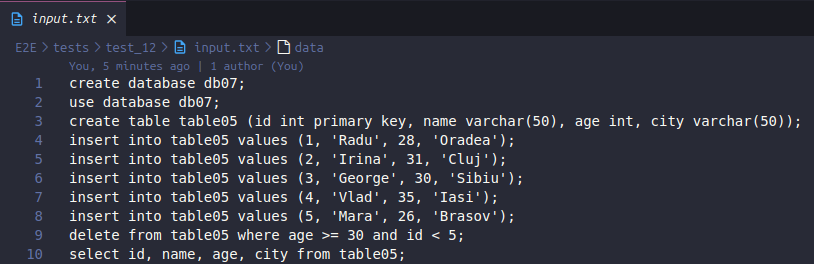
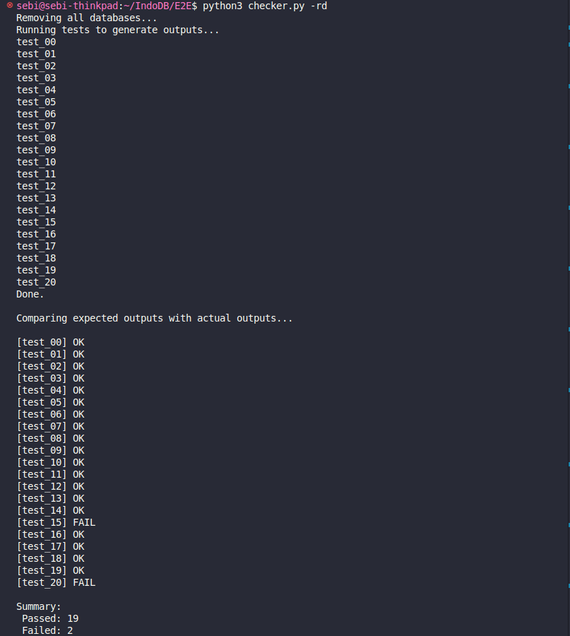

# Testare Automată

Proiectul include un sistem de **testare automată** care acoperă toate funcționalitățile de bază ale SGBD-ului, utilizând un script Python ce simulează utilizarea reală a aplicației prin testarea tuturor combinațiilor semnificative de inputuri.

### Ce testează?

Scriptul de test automat acoperă:

- Crearea de tabele (`CREATE TABLE`)
- Inserarea de date (`INSERT INTO`)
- Selectarea de date (`SELECT ... WHERE`)
- Actualizarea de date (`UPDATE`)
- Ștergerea de date (`DELETE`)
- Tratarea erorilor (inputuri invalide, tipuri greșite, comenzi incomplete)
- Persistența datelor între rulări
- Teste cu combinații valide și invalide de:
  - Nume de tabel
  - Tipuri de coloane (int, varchar)
  - Condiții în `WHERE`
  - Structuri de comenzi incomplete sau incorecte
- Etc

---

### Structura Fișierului de Test

---

### Exemplu de Execuție în Terminal

---
